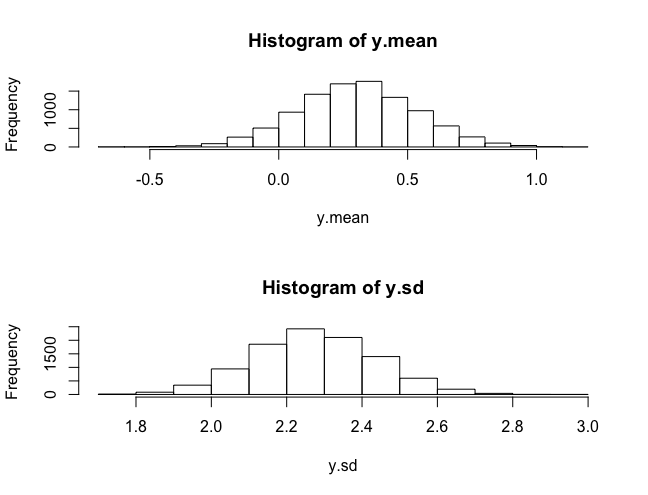

# doubly_robust_CI_simulation
This is R implementation of the simulation in Funk et al.(2011).

# Generating the datasets

Please run the following procedure.  
This will create the datasets in data directory.

1. Launch R.
2. Run `execute_data_generator.R`.

# Checking the data generator

## Result

### Console

```
> # Check simulation data.
> #
> # This is the program to check data generator.
> #
> # Confirming that generator was correctly implemented of
> # the .... [TRUNCATED] 

> kNumIterations <- 10000

> kSampleSize <- 100

> y.mean <- numeric(kNumIterations)

> y.sd <- numeric(kNumIterations)

> for (sim in 1:kNumIterations) {
+   simulation.data <- GenerateSimulationData(size = kSampleSize)
+   y.mean[sim] <- mean(simulation.data$y)
+   y.s .... [TRUNCATED] 

> print(paste("mean(y.mean) =", mean(y.mean), ", SE(y.mean) =", sd(y.mean)))
[1] "mean(y.mean) = 0.302880062234708 , SE(y.mean) = 0.228759480251698"

> print(paste("mean(y.sd) =", mean(y.sd), ", SE(y.sd) =", sd(y.sd)))
[1] "mean(y.sd) = 2.27504598609665 , SE(y.sd) = 0.161682143370776"

> par(mfrow = c(2, 1))

> hist(y.mean)

> hist(y.sd)

> par(mfrow = c(1, 1))
```

### Histogram



# References

Funk et al., 2011, Doubly Robust Estimation of Causal Effects, American Journal of Epidemiology, Vol. 173, No. 7, 761-767.
